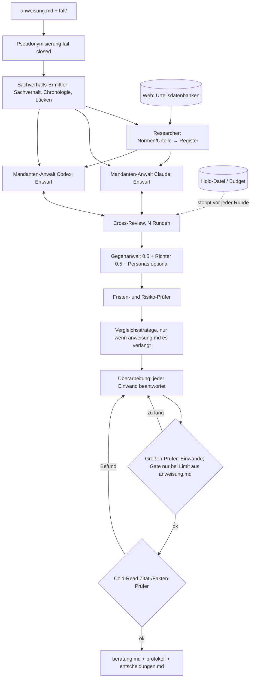

# Ablauf

```mermaid
flowchart TD
  A[anweisung.md + fall/] --> P[Pseudonymisierung fail-closed]
  P --> S[Sachverhalts-Ermittler: Sachverhalt, Chronologie, Lücken]
  S --> R[Researcher: Normen/Urteile → Register]
  S --> E1[Mandanten-Anwalt Claude: Entwurf]
  S --> E2[Mandanten-Anwalt Codex: Entwurf]
  W[(Web: Urteilsdatenbanken)] --> R
  R --> E1
  R --> E2
  E1 <--> X[Cross-Review, N Runden]
  E2 <--> X
  X --> G[Gegenanwalt 0.5 + Richter 0.5 + Personas optional]
  G --> F[Fristen- und Risiko-Prüfer]
  F --> V[Vergleichsstratege, nur wenn anweisung.md es verlangt]
  V --> U[Überarbeitung: jeder Einwand beantwortet]
  U --> L{Größen-Prüfer: Einwände; Gate nur bei Limit aus anweisung.md}
  L -- zu lang --> U
  L -- ok --> C{Cold-Read Zitat-/Fakten-Prüfer}
  C -- Befund --> U
  C -- ok --> O[beratung.md + protokoll + entscheidungen.md]
  H[(Hold-Datei / Budget)] -. stoppt vor jeder Runde .-> X
```

Der Conductor (Python) führt alle Schritte aus und prüft vor jeder Runde die Hold-Datei und das Budget.
